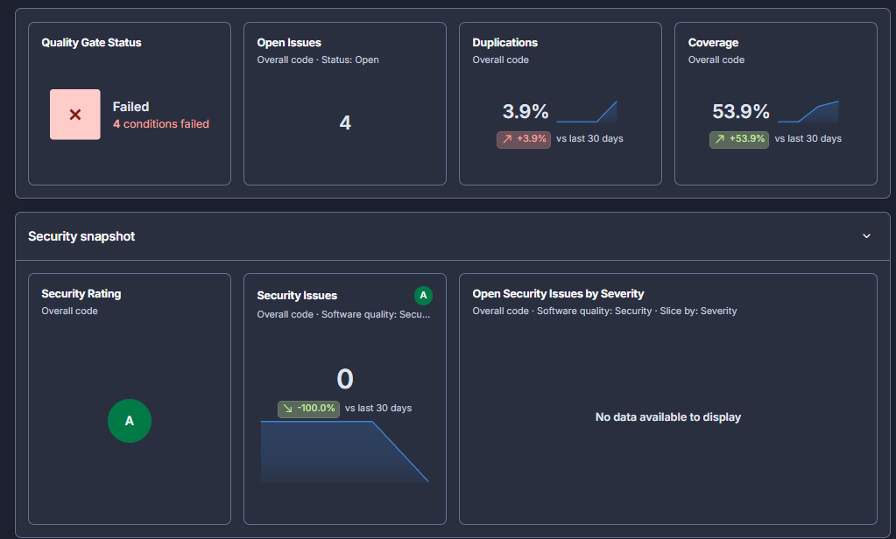
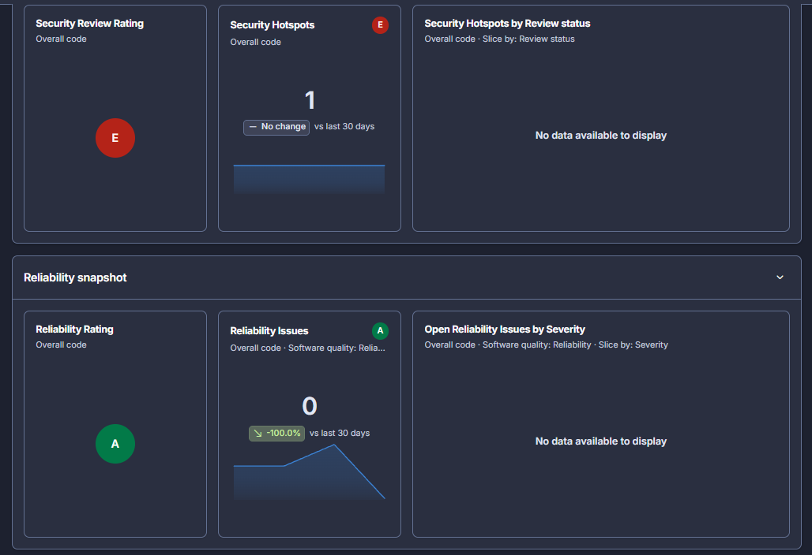
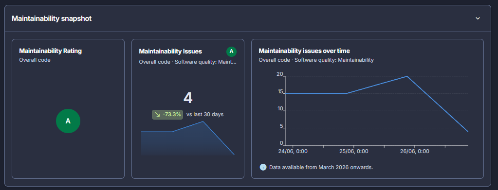
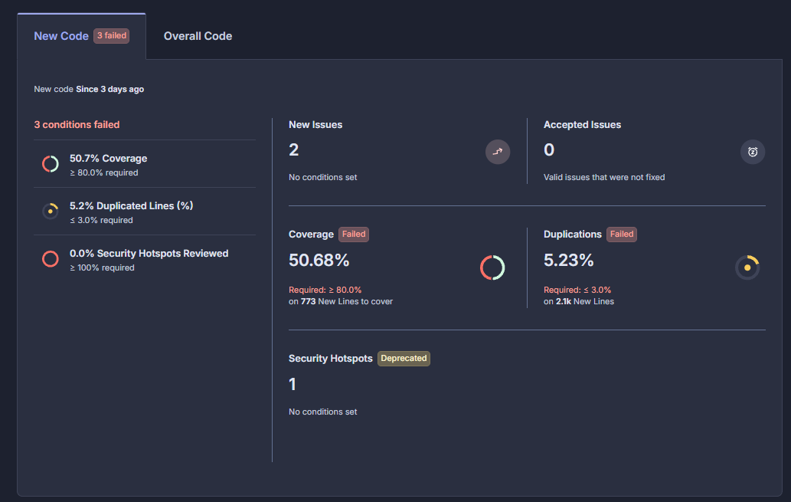
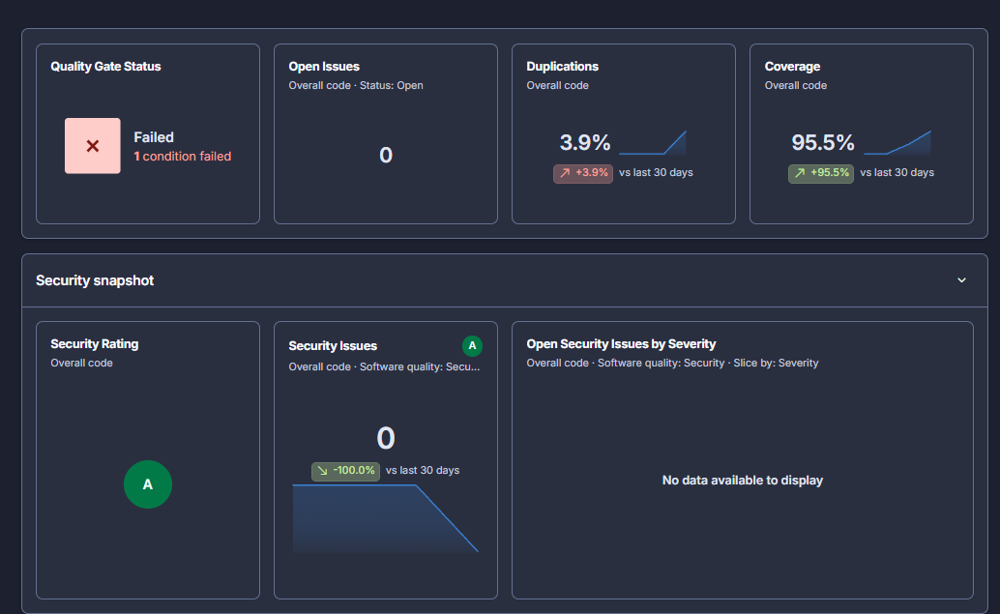
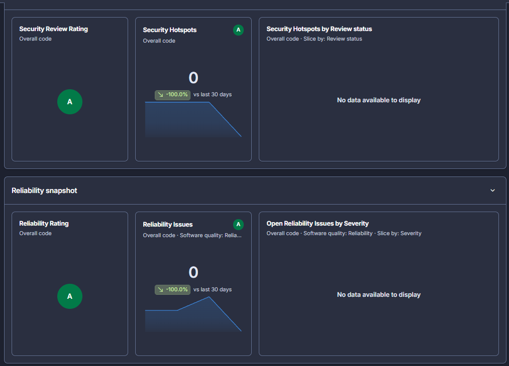
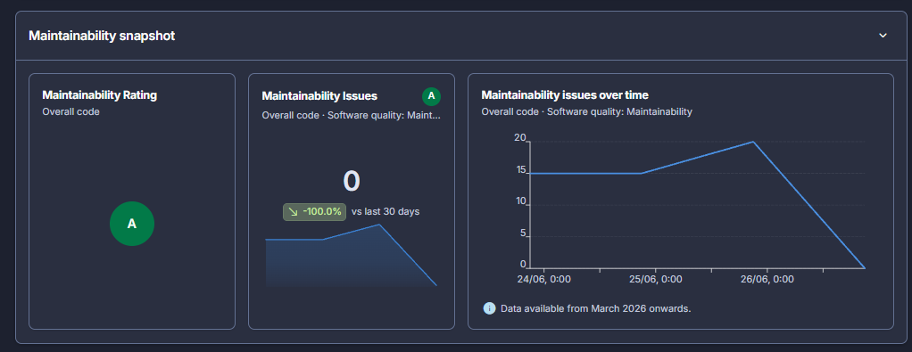
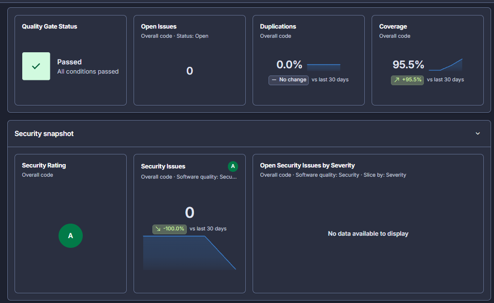
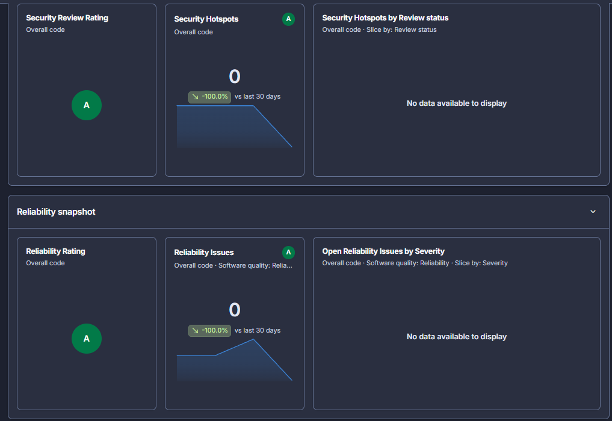
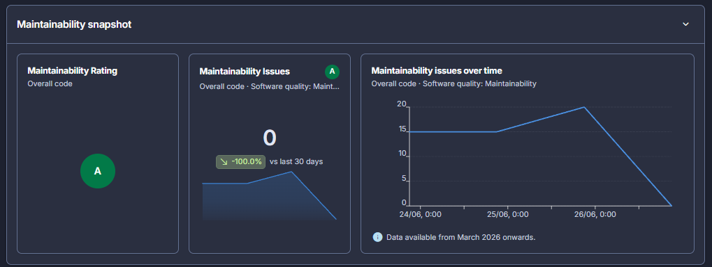

# Histórico de análises do SonarQube

Este documento registra a evolução da qualidade do projeto durante as análises realizadas em **26 e 27 de junho de 2026**.

Os valores abaixo foram transcritos dos painéis preservados nas capturas de tela. As imagens continuam disponíveis em cada rodada para consulta e auditoria.

## Resultado alcançado

Entre a primeira e a última análise, o projeto evoluiu de:

- **Quality Gate reprovado** para **aprovado**;
- **24 problemas abertos** para **nenhum problema aberto**;
- **40,5% de cobertura** para **95,5%**;
- **1 problema de segurança** para **nenhum**;
- **1 hotspot de segurança pendente** para **nenhum**;
- problemas de confiabilidade e manutenibilidade para **zero**;
- duplicação final de **0,0%**.

> O Quality Gate representa o conjunto de critérios mínimos configurados no SonarQube. Uma análise pode ter boas notas individuais e ainda ser reprovada se ao menos uma condição obrigatória não for atendida.

## Evolução consolidada

| Data e rodada | Quality Gate | Problemas abertos | Cobertura | Duplicação | Segurança | Hotspots | Confiabilidade | Manutenibilidade |
|---|---:|---:|---:|---:|---:|---:|---:|---:|
| 26/06 — análise inicial | Reprovado | 24 | 40,5% | 0,0% | 1 — nota C | 1 — nota E | 5 — nota A | 20 — nota A |
| 27/06 — rodada 1 | Reprovado | 27 | 62,1% | 0,0% | 1 — nota C | 1 — nota E | 3 — nota A | 23 — nota A |
| 27/06 — rodada 2 | Reprovado | 31 | 56,3% | 0,0% | 0 — nota A | 1 — nota E | 4 — nota A | 27 — nota A |
| 27/06 — rodada 3 | Reprovado | 9 | 53,9% | 0,0% | 0 — nota A | 1 — nota E | 0 — nota A | 9 — nota A |
| 27/06 — rodada 4 | Reprovado | 4 | 53,9% | 3,9% | 0 — nota A | 1 — nota E | 0 — nota A | 4 — nota A |
| 27/06 — rodada 5 | Reprovado | 0 | 95,5% | 3,9% | 0 — nota A | 0 — nota A | 0 — nota A | 0 — nota A |
| 27/06 — rodada 6 | **Aprovado** | **0** | **95,5%** | **0,0%** | **0 — nota A** | **0 — nota A** | **0 — nota A** | **0 — nota A** |

## Linha do tempo detalhada

### 26/06/2026 — análise inicial

Primeiro diagnóstico registrado. O Quality Gate foi reprovado, com 24 problemas abertos, cobertura de 40,5%, um problema de segurança e um hotspot ainda não revisado.

Exibir capturas da análise inicial

#### Visão geral e segurança

#### Hotspots e confiabilidade

#### Manutenibilidade

### 27/06/2026 — rodada 1

A cobertura avançou para 62,1%. Permaneceram um problema de segurança e um hotspot pendente. O total chegou a 27 problemas abertos.

Exibir capturas da rodada 1

#### Visão geral e segurança

#### Hotspots e confiabilidade

#### Manutenibilidade

### 27/06/2026 — rodada 2

O problema de segurança foi resolvido, elevando a nota de segurança para A. O hotspot continuou pendente e houve aumento temporário dos problemas de confiabilidade e manutenibilidade.

Exibir capturas da rodada 2

#### Visão geral e segurança

#### Hotspots e confiabilidade

#### Manutenibilidade

### 27/06/2026 — rodada 3

Houve uma redução expressiva dos problemas: confiabilidade chegou a zero e manutenibilidade caiu para nove. O Quality Gate ainda falhou em duas condições.

Exibir capturas da rodada 3

#### Visão geral e segurança

#### Hotspots e confiabilidade

#### Manutenibilidade

### 27/06/2026 — rodada 4

Os problemas abertos caíram para quatro, todos os indicadores de segurança e confiabilidade permaneceram sem problemas, e a manutenibilidade chegou a quatro. Nesta rodada surgiu duplicação de 3,9%, e as condições específicas de código novo também ficaram visíveis.

Exibir capturas da rodada 4

#### Visão geral e segurança

#### Hotspots e confiabilidade

#### Manutenibilidade

#### Condições do código novo

Na visão de código novo, as três condições reprovadas eram:

- cobertura de **50,68%**, abaixo dos **80%** exigidos;
- duplicação de **5,23%**, acima dos **3%** permitidos;
- **0% dos hotspots revisados**, abaixo dos **100%** exigidos.

### 27/06/2026 — rodada 5

Todos os problemas e hotspots foram resolvidos, e a cobertura chegou a 95,5%. Restou uma única condição reprovada: a duplicação de 3,9%.

Exibir capturas da rodada 5

#### Visão geral e segurança

#### Hotspots e confiabilidade

#### Manutenibilidade

### 27/06/2026 — rodada 6 — resultado final

Após a remoção da duplicação restante, todas as condições foram atendidas e o **Quality Gate foi aprovado**.

Exibir capturas do resultado final

#### Visão geral e segurança

#### Hotspots e confiabilidade

#### Manutenibilidade

## Leitura do resultado final

O último painel registra:

| Indicador | Resultado final |
|---|---:|
| Quality Gate | **Aprovado** |
| Problemas abertos | **0** |
| Cobertura | **95,5%** |
| Duplicação | **0,0%** |
| Problemas de segurança | **0 — nota A** |
| Hotspots de segurança | **0 — nota A** |
| Problemas de confiabilidade | **0 — nota A** |
| Problemas de manutenibilidade | **0 — nota A** |

As capturas documentam o estado do projeto em cada análise. Os valores correntes podem mudar à medida que o código e as regras do Quality Gate evoluírem.
