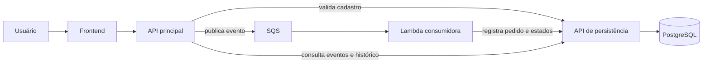

# ES2 — Sistema de Pedidos

Sistema demonstrativo que recebe solicitações de pedidos, valida cliente e produto, coloca cada solicitação em uma fila e registra o resultado no PostgreSQL. O projeto inclui interface web, APIs, processamento assíncrono, histórico de estados e uma estratégia de testes unitários, de ponta a ponta (E2E) e de segurança estática (SAST).

> **Em linguagem simples:** a aplicação funciona como uma loja com uma área de atendimento e outra de processamento. A área de atendimento confere se o cliente e o produto existem, entrega um protocolo e coloca o pedido em uma fila. A área de processamento retira o pedido da fila, salva os dados e registra cada etapa no histórico.

## Sumário

- [O que o sistema faz](#o-que-o-sistema-faz)
- [Regra de negócio](#regra-de-negócio)
- [Arquitetura e componentes](#arquitetura-e-componentes)
- [Como executar](#como-executar)
- [Como usar](#como-usar)
- [Referência da API](#referência-da-api)
- [Estratégia de testes](#estratégia-de-testes)
- [Testes unitários](#testes-unitários)
- [Testes E2E](#testes-e2e)
- [Testes de segurança SAST](#testes-de-segurança-sast)
- [Cobertura e SonarQube](#cobertura-e-sonarqube)
- [Configuração técnica](#configuração-técnica)
- [Solução de problemas](#solução-de-problemas)

## O que o sistema faz

O usuário informa apenas dois números: o identificador do cliente e o identificador do produto. A partir daí, o sistema:

1. verifica se os números são válidos;
2. confirma no cadastro se o cliente e o produto existem;
3. gera um protocolo para acompanhar a solicitação;
4. coloca a solicitação em uma fila de processamento;
5. responde imediatamente que ela foi aceita;
6. processa e grava o pedido em segundo plano;
7. disponibiliza a consulta dos pedidos e de seu histórico.

### “Aceito” não significa “concluído”

Quando a API responde `202 Accepted`, o pedido passou pelas validações e entrou na fila. Essa resposta **não afirma que a gravação já terminou**. O processamento acontece de forma assíncrona, isto é, em segundo plano. A conclusão deve ser confirmada pela listagem de eventos ou pelo histórico do pedido.

Essa escolha mantém o atendimento rápido mesmo quando há muitos pedidos. Se o processamento falhar, a fila permite uma nova tentativa sem obrigar o usuário a manter a tela aberta.

### Glossário rápido

| Termo | Significado neste projeto |
|---|---|
| API | Porta de entrada usada pela interface e por outros sistemas. |
| Evento | Registro técnico que representa uma solicitação de pedido. |
| SQS/fila | Lista de solicitações aguardando processamento. |
| Lambda | Trabalhador que consome a fila e processa cada solicitação. |
| Persistência | Gravação definitiva das informações no banco de dados. |
| Cache | Memória temporária que evita repetir algumas consultas ao banco. |
| Teste unitário | Verifica uma pequena parte do código de forma isolada. |
| Teste E2E | Exercita o caminho completo, da API até o banco de dados. |
| SAST | Analisa o código-fonte em busca de padrões inseguros sem executar a aplicação. |

## Regra de negócio

### Entrada de uma solicitação

Uma solicitação contém:

```json
{
  "clienteId": 1,
  "produtoId": 1
}
```

As regras são aplicadas nesta ordem:

| Regra | Motivo | Resultado quando não atendida |
|---|---|---|
| `clienteId` deve ser maior que zero | IDs nulos ou negativos não representam um cadastro válido | HTTP `400 Bad Request` |
| `produtoId` deve ser maior que zero | Mesma proteção aplicada ao produto | HTTP `400 Bad Request` |
| O cliente deve existir | Impede pedido associado a uma pessoa inexistente | HTTP `400 Bad Request` |
| O produto deve existir | Impede pedido de um item fora do cadastro | HTTP `400 Bad Request` |
| A fila e a API interna devem estar disponíveis | Sem essas dependências, o sistema não pode garantir o encaminhamento | HTTP `503 Service Unavailable` |

As verificações de existência são feitas pela API de persistência. Os resultados ficam em cache por 300 segundos por padrão, inclusive respostas negativas. Isso reduz acessos repetidos ao PostgreSQL. Cada cliente e produto possui sua própria entrada de cache.

### Criação do protocolo

Depois das validações, a API cria um `eventoId` no formato:

```text
ES2-12345678-153015
```

- `ES2` identifica o projeto;
- os oito dígitos centrais são gerados com um gerador criptograficamente seguro;
- os seis últimos dígitos representam hora, minuto e segundo no horário de Brasília.

O banco também possui uma restrição de unicidade para `eventoId`. Assim, o mesmo protocolo não pode originar dois pedidos.

### Processamento e estados do pedido

O fluxo normal registra três estados:

```text
Recebido → Processando → Concluído
```

Quando o processamento não pode ser concluído, o sistema tenta registrar:

```text
Recebido → Erro
```

| Estado | Interpretação de negócio |
|---|---|
| `Recebido` | A solicitação chegou ao processador. |
| `Processando` | A gravação do pedido foi iniciada. |
| `Concluido` | Pedido e histórico foram persistidos com sucesso. |
| `Erro` | Houve uma falha; o campo `detalhe` registra uma descrição controlada. |

Pedido e estados são gravados na mesma transação do banco: ou a operação inteira é confirmada, ou nenhuma parte incompleta é efetivada.

### Idempotência e novas tentativas

Filas podem entregar a mesma mensagem mais de uma vez. Para evitar pedidos duplicados, a persistência procura o `eventoId` antes de inserir e adiciona somente os estados ainda ausentes. O banco reforça a proteção com duas restrições únicas:

- um único pedido para cada `eventoId`;
- um único registro de cada estado para cada pedido.

Se duas cópias forem processadas ao mesmo tempo, a aplicação trata o conflito de unicidade, recarrega o pedido e completa apenas o que estiver faltando. Esse comportamento é chamado de **idempotência**: repetir a mesma operação produz o mesmo resultado final.

A Lambda informa individualmente quais mensagens de um lote falharam (`ReportBatchItemFailures`). Somente essas mensagens voltam para nova tentativa. Após cinco recebimentos sem sucesso, a configuração local encaminha a mensagem para a fila de mensagens mortas, ou **DLQ**, para análise posterior.

### Histórico imutável

O histórico é append-only: novos estados podem ser acrescentados, mas estados existentes não podem ser editados ou excluídos diretamente. Essa regra existe em duas camadas:

- a aplicação rejeita alterações e exclusões pelo Entity Framework;
- um gatilho do PostgreSQL impede `UPDATE` e `DELETE` na tabela `pedido_status`.

Isso preserva a rastreabilidade. A exclusão em cascata continua permitida apenas quando o próprio pedido raiz é removido, comportamento usado na preparação dos testes.

### Datas e horários

- A API apresenta datas no fuso de Brasília (`America/Sao_Paulo` ou o equivalente do Windows).
- O PostgreSQL armazena os instantes em UTC por meio de `TIMESTAMPTZ`.
- O momento `salvoEm` deve ser igual ou posterior ao momento em que o evento foi criado.

## Arquitetura e componentes



Somente a API de persistência acessa o banco. A API principal e a Lambda conversam com ela por HTTP. Essa separação centraliza as regras de gravação e evita que vários componentes manipulem o PostgreSQL diretamente.

| Componente | Responsabilidade | Tecnologia |
|---|---|---|
| Frontend | Formulário, saúde do sistema, lista e histórico | HTML, CSS, TypeScript, Vite e Nginx |
| API principal | Validação, protocolo, publicação na fila e consultas públicas | ASP.NET Core / .NET 10 |
| API de persistência | Cache, consultas e gravação transacional | ASP.NET Core, EF Core e Npgsql / .NET 10 |
| Fila | Desacoplamento e novas tentativas | Amazon SQS, emulada localmente pelo Floci |
| Lambda | Consumo e processamento das mensagens | AWS Lambda / .NET 8 |
| Shared | Contratos, domínio, acesso a dados e logging compartilhados | .NET 8 e .NET 10 |
| Banco | Cadastros, eventos e histórico | PostgreSQL 15 |

### Estrutura do repositório

```text
.
|-- .github/workflows/             # Automação de build, SonarQube, SAST e PRs
|-- database/
|   |-- 01-ddl.sql                 # Tabelas, índices, restrições e trigger
|   `-- 02-dml.sql                 # Clientes e produtos de exemplo
|-- docker/
|   |-- aws/init-aws.sh            # Fila, DLQ, Lambda e gatilho local
|   |-- docker-compose.yml         # Ambiente completo
|   `-- Dockerfile.*               # Imagens dos componentes
|-- documentacao/sonar/            # Histórico visual das análises SonarQube
|-- src/
|   |-- ES2-SistemaPedidos.Api/
|   |-- ES2-SistemaPedidos.FrontEnd/
|   |-- ES2-SistemaPedidos.LambdaConsumerSQS/
|   |-- ES2-SistemaPedidos.PersistenciaApi/
|   `-- ES2-SistemaPedidos.Shared/
|-- tests/
|   |-- e2e/                       # Cenários Reqnroll/Gherkin
|   |-- sast/                      # Analisador de segurança próprio
|   `-- unit/                      # Testes unitários do backend
|-- coverlet.runsettings           # Configuração de cobertura .NET
`-- ES2-SistemaPedidos.sln         # Solução .NET
```

## Como executar

### Pré-requisitos

Para o caminho recomendado, instale:

- Docker Desktop ou Docker Engine com Docker Compose;

Para desenvolvimento e testes locais também são usados:

- SDKs .NET 8 e .NET 10;
- Node.js 22 e npm.

### Ambiente completo com Docker

Na raiz do repositório:

```powershell
docker compose -f docker/docker-compose.yml up --build
```

O primeiro build pode demorar alguns minutos. O ambiente estará pronto quando `database-init` e `aws-init` terminarem com sucesso e os demais serviços permanecerem em execução.

| Serviço | Endereço local |
|---|---|
| Interface web | <http://localhost:8000> |
| API principal | <http://localhost:8080> |
| Swagger da API principal | <http://localhost:8080/swagger> |
| Health check | <http://localhost:8080/api/healthcheck> |
| Swagger da API de persistência | <http://localhost:8081/swagger> |
| Emulador AWS/Floci | <http://localhost:4566> |
| PostgreSQL | `localhost:5432` |

Para parar:

```powershell
docker compose -f docker/docker-compose.yml down
```

Para parar e apagar o volume do banco, recriando os dados na próxima subida:

```powershell
docker compose -f docker/docker-compose.yml down -v
```

> O comando com `-v` apaga os dados locais do PostgreSQL. Use-o apenas quando essa limpeza for intencional.

### Frontend em modo de desenvolvimento

Com a API disponível em `http://localhost:8080`:

```powershell
cd src/ES2-SistemaPedidos.FrontEnd
npm ci
npm run dev
```

Acesse <http://localhost:8000>. O código TypeScript é compilado no build; não existe um `script.js` versionado.

### Backend fora do Docker

Restaurar e compilar:

```powershell
dotnet restore ES2-SistemaPedidos.sln
dotnet build ES2-SistemaPedidos.sln
```

Para executar fora dos contêineres, PostgreSQL, Floci, API de persistência e API principal precisam estar configurados. Exemplo de variáveis para a API principal:

```powershell
$env:ASPNETCORE_ENVIRONMENT = "Development"
$env:AWS__Regiao = "us-east-1"
$env:AWS__ServiceUrl = "http://localhost:4566"
$env:SQS_FILA_URL = "http://localhost:4566/000000000000/processamento-solicitacoes"
$env:PersistenciaApi__UrlBase = "http://localhost:5080"
dotnet run --project src/ES2-SistemaPedidos.Api/ES2-SistemaPedidos.Api.csproj
```

A API de persistência pode ser iniciada em outro terminal:

```powershell
$env:ConnectionStrings__BancoPedidos = "Host=localhost;Port=5432;Database=es2_pedidos;Username=dev;Password=dev"
dotnet run --project src/ES2-SistemaPedidos.PersistenciaApi/ES2-SistemaPedidos.PersistenciaApi.csproj --urls http://localhost:5080
```

## Como usar

O banco inicial contém clientes e produtos com IDs de `1` a `4`. Pela interface web:

1. abra <http://localhost:8000>;
2. confirme que o indicador de saúde está conectado;
3. informe um cliente e um produto, por exemplo `1` e `1`;
4. envie a solicitação;
5. guarde o protocolo retornado;
6. após alguns instantes, atualize a lista de pedidos;
7. abra o histórico do pedido para conferir seus estados.

Pelo PowerShell:

```powershell
Invoke-RestMethod `
  -Method Post `
  -Uri http://localhost:8080/api/solicitacoes `
  -ContentType "application/json" `
  -Body '{"clienteId":1,"produtoId":1}'
```

Listar pedidos já processados:

```powershell
Invoke-RestMethod http://localhost:8080/api/solicitacoes/eventos
```

## Referência da API

### `GET /api/healthcheck`

Verifica ativamente a API de persistência e o Floci. Retorna `200 OK` quando as dependências estão saudáveis e `503 Service Unavailable` quando alguma está indisponível.

### `POST /api/solicitacoes`

Valida e aceita uma nova solicitação.

Resposta de sucesso — `202 Accepted`:

```json
{
  "clienteId": 1,
  "produtoId": 1,
  "eventoId": "ES2-12345678-153015",
  "dataHoraRequisicao": "2026-05-10T15:30:15-03:00"
}
```

Resposta de regra de negócio — `400 Bad Request`:

```json
{
  "erro": "ValidacaoFalhou",
  "mensagem": "A validacao da solicitacao falhou",
  "detalhes": [
    {
      "campo": "clienteId",
      "erro": "Cliente 9998 nao encontrado."
    }
  ]
}
```

Uma falha temporária de persistência ou mensageria retorna `503 Service Unavailable` e indica nova tentativa após 30 segundos.

### `GET /api/solicitacoes/eventos`

Lista, em ordem de gravação, os pedidos que já chegaram ao PostgreSQL. Um pedido apenas aceito pela fila pode levar alguns instantes para aparecer.

### `GET /api/solicitacoes/{id}/historico`

Retorna os estados do pedido em ordem de inserção. O `{id}` é o identificador numérico do pedido no banco, não o `eventoId`.

- ID menor ou igual a zero: `400 Bad Request`;
- pedido inexistente: `404 Not Found`;
- pedido encontrado: `200 OK`.

```json
{
  "pedidoId": 1,
  "eventoId": "ES2-12345678-153015",
  "historico": [
    {
      "id": 1,
      "status": "Recebido",
      "registradoEm": "2026-05-10T15:30:15-03:00",
      "detalhe": null
    },
    {
      "id": 2,
      "status": "Processando",
      "registradoEm": "2026-05-10T15:30:16-03:00",
      "detalhe": null
    },
    {
      "id": 3,
      "status": "Concluido",
      "registradoEm": "2026-05-10T15:30:16-03:00",
      "detalhe": null
    }
  ]
}
```

### Endpoints internos

A API de persistência expõe endpoints para uso da API principal e da Lambda:

| Método e rota | Uso |
|---|---|
| `GET /api/consultas/clientes/{id}/existe` | Verifica o cliente com cache. |
| `GET /api/consultas/produtos/{id}/existe` | Verifica o produto com cache. |
| `GET /api/consultas/eventos` | Lista os pedidos persistidos. |
| `GET /api/consultas/pedidos/{id}/historico` | Obtém o histórico. |
| `POST /api/processamentos/pedidos` | Registra o fluxo concluído. |
| `POST /api/processamentos/pedidos/erro` | Registra uma falha de processamento. |

Esses endpoints são internos por decisão arquitetural e não devem substituir as rotas públicas da API principal.

## Estratégia de testes

Cada tipo de teste responde a uma pergunta diferente:

| Tipo | Pergunta respondida | Dependências reais | Velocidade típica |
|---|---|---|---|
| Unitário | “Esta regra ou componente funciona isoladamente?” | Não; usa dublês, mocks ou banco em memória | Rápida |
| E2E | “O pedido percorre o sistema inteiro?” | Sim; API, fila, Lambda e PostgreSQL | Mais lenta |
| SAST | “O código contém algum padrão inseguro conhecido pelas regras?” | Não executa o sistema | Rápida |

Os testes são complementares. Um teste unitário pode confirmar uma validação, mas não prova que a fila está conectada. Um E2E prova a integração, mas não explora todas as ramificações com a mesma rapidez. O SAST encontra determinados padrões de risco, mas não comprova o comportamento funcional nem a segurança em tempo de execução.

## Testes unitários

### O que são

Testes unitários exercitam uma unidade pequena — normalmente um método ou classe — mantendo fora do teste serviços externos como PostgreSQL, SQS e APIs. Isso torna a execução rápida e permite simular erros difíceis de reproduzir manualmente.

No backend, os testes usam xUnit. No frontend, usam Vitest com JSDOM para simular o navegador.

### Cobertura funcional do backend

| Projeto de teste | Principais comportamentos verificados |
|---|---|
| `Api.UnitTests` | IDs inválidos, cliente/produto inexistente, publicação válida, geração de protocolo, datas de Brasília, consultas, respostas HTTP, falhas `503`, cliente HTTP, SQS e health checks |
| `LambdaConsumerSQS.UnitTests` | Payload válido, nulo ou inválido, falha parcial do lote, registro de erro, preservação da exceção e chamadas HTTP à persistência |
| `PersistenciaApi.UnitTests` | Cache por ID, consultas, ordenação, histórico, idempotência, estados concluído/erro, controllers e health check do PostgreSQL |
| `Shared.UnitTests` | Entidades, mapeamentos, histórico imutável, configuração obrigatória do banco e formatação de logs |

Os testes de repositório que usam o provedor em memória confirmam a lógica do Entity Framework. Restrições específicas do PostgreSQL, como trigger e concorrência real, exigem E2E ou teste de integração com PostgreSQL.

### Executar o backend

Cada projeto pode ser executado isoladamente:

```powershell
dotnet test tests/unit/ES2-SistemaPedidos.Api.UnitTests/ES2-SistemaPedidos.Api.UnitTests.csproj
dotnet test tests/unit/ES2-SistemaPedidos.LambdaConsumerSQS.UnitTests/ES2-SistemaPedidos.LambdaConsumerSQS.UnitTests.csproj
dotnet test tests/unit/ES2-SistemaPedidos.PersistenciaApi.UnitTests/ES2-SistemaPedidos.PersistenciaApi.UnitTests.csproj
dotnet test tests/unit/ES2-SistemaPedidos.Shared.UnitTests/ES2-SistemaPedidos.Shared.UnitTests.csproj
```

Executar todos os projetos unitários pelo PowerShell:

```powershell
Get-ChildItem tests/unit -Recurse -Filter *.csproj | ForEach-Object {
  dotnet test $_.FullName
  if ($LASTEXITCODE -ne 0) { throw "Falha nos testes de $($_.Name)" }
}
```

### Executar o frontend

```powershell
cd src/ES2-SistemaPedidos.FrontEnd
npm ci
npm test
```

Os testes do frontend verificam health check, diagnóstico de dependências, criação e validação do formulário, lista vazia ou preenchida, consulta do histórico, apresentação de erros HTTP e interrupções de rede.

### Gerar cobertura local

Backend, no diretório raiz:

```powershell
Get-ChildItem tests/unit -Recurse -Filter *.csproj | ForEach-Object {
  dotnet test $_.FullName `
    --collect:"XPlat Code Coverage" `
    --results-directory TestResults `
    --settings coverlet.runsettings
  if ($LASTEXITCODE -ne 0) { throw "Falha nos testes de $($_.Name)" }
}
```

O arquivo `coverlet.runsettings` gera formatos Cobertura e OpenCover e exclui `Program.cs` e artefatos de `obj`.

Frontend:

```powershell
cd src/ES2-SistemaPedidos.FrontEnd
npm run test:coverage
```

Cobertura mede quais trechos foram executados, não a qualidade das asserções. Uma porcentagem alta não substitui cenários relevantes de negócio.

## Testes E2E

### O que eles comprovam

E2E significa end-to-end, ou “de ponta a ponta”. Estes testes enviam requisições HTTP reais e verificam o resultado no PostgreSQL real. Portanto, exercitam em conjunto:

```text
API → API de persistência → SQS → Lambda → API de persistência → PostgreSQL
```

Os cenários são escritos em Gherkin com Reqnroll. A notação `Given / When / Then` aparece como `Dado / Quando / Então` na leitura de negócio e aproxima o teste de uma especificação funcional.

Exemplo conceitual:

```gherkin
Dado que cliente e produto existem
Quando uma solicitação é enviada
Então a API deve aceitá-la
E o evento deve aparecer no banco após o processamento da fila
```

### Preparação e isolamento

Antes dos cenários, a fixture:

1. aguarda o health check da API por até 30 segundos;
2. abre uma conexão real com PostgreSQL;
3. cria ou atualiza o cliente `9999` e o produto `9999`;
4. remove eventos anteriores associados a esses dados de teste.

IDs `9998` representam registros inexistentes nos cenários negativos. A limpeza é limitada ao cliente e produto de teste para não apagar os dados comuns da aplicação.

Como o processamento é assíncrono, o teste consulta o banco a cada 500 milissegundos, por até 15 tentativas, aguardando o `eventoId`. Essa espera ativa evita um atraso fixo desnecessário e reduz instabilidade.

> Os E2E acessam diretamente o banco para preparar e confirmar dados. Isso oferece uma verificação forte da persistência, embora não seja um teste estritamente “caixa-preta”.

### Cenários cobertos

- criação de uma solicitação válida e retorno de `202 Accepted`;
- persistência do evento depois do processamento da fila;
- conferência de cliente, produto, protocolo e timestamps salvos;
- consulta da lista de eventos pela API;
- processamento de três solicitações distintas;
- rejeição de cliente e produto inexistentes;
- unicidade dos protocolos;
- lista sem eventos de teste;
- coerência entre horário do evento e horário de gravação;
- payload malformado e JSON vazio;
- rejeição de `Content-Type` incorreto com HTTP `415`;
- filtragem dos eventos usados pelo cenário.

### Como executar

1. Suba o ambiente completo e aguarde sua inicialização:

```powershell
docker compose -f docker/docker-compose.yml up --build
```

2. Em outro terminal, na raiz do repositório:

```powershell
dotnet test tests/e2e/ES2-SistemaPedidos.E2ETests/ES2-SistemaPedidos.E2ETests.csproj
```

Configurações aceitas:

| Variável | Padrão | Uso |
|---|---|---|
| `API_BASE_URL` | `http://localhost:8080` | Endereço da API testada |
| `DATABASE_URL` | `Host=localhost;Port=5432;Database=es2_pedidos;Username=dev;Password=dev` | Banco usado na preparação e verificação |

Exemplo contra outro ambiente:

```powershell
$env:API_BASE_URL = "http://localhost:8080"
$env:DATABASE_URL = "Host=localhost;Port=5432;Database=es2_pedidos;Username=dev;Password=dev"
dotnet test tests/e2e/ES2-SistemaPedidos.E2ETests/ES2-SistemaPedidos.E2ETests.csproj
```

Não execute os E2E contra produção: a suíte cria cadastros e remove eventos dos IDs reservados para teste.

### Por que `dotnet test ES2-SistemaPedidos.sln` exige atenção

A solução inclui testes unitários e E2E. Portanto, o comando abaixo só deve ser usado com a stack disponível:

```powershell
dotnet test ES2-SistemaPedidos.sln
```

Para uma verificação rápida e independente de infraestrutura, prefira os comandos da seção de testes unitários.

## Testes de segurança SAST

### O que é SAST

SAST é a análise estática de segurança do código. Ela procura construções potencialmente perigosas sem iniciar API, banco ou fila. É semelhante a uma revisão automática que lê a estrutura do programa.

O projeto possui um analisador próprio em `tests/sast/SastEngine.Console`, construído com Roslyn. Ele localiza a solução, compila os projetos em memória e aplica as regras a cada árvore sintática C#.

### Regras implementadas

| ID | Regra | O que procura | Orientação |
|---|---|---|---|
| `SAST001` | Criptografia insegura | Uso de `MD5`, `SHA1`, `DES`, `TripleDES`, `RC4` e variantes comuns | Usar algoritmos atuais, como SHA-256 e AES, conforme o contexto |
| `SAST002` | Segredo hardcoded | Literais atribuídos a nomes como `password`, `secret`, `key`, `token`, `connectionString`, `pwd` ou `passwd`, além de padrões de conexão/credencial em strings | Carregar segredos de variáveis, configuração externa ou cofre de segredos |

Código gerado é ignorado e as regras podem ser executadas concorrentemente.

### Escopo atual

São analisados:

- `ES2-SistemaPedidos.Api`;
- `ES2-SistemaPedidos.LambdaConsumerSQS`;
- `ES2-SistemaPedidos.PersistenciaApi`;
- `ES2-SistemaPedidos.Shared` em seus frameworks-alvo.

Não fazem parte dessa varredura própria:

- frontend TypeScript;
- arquivos YAML, SQL, shell e Dockerfiles;
- bibliotecas de terceiros e vulnerabilidades conhecidas de pacotes;
- infraestrutura em execução, autenticação, autorização ou ataques HTTP;
- segredos com formatos ou fluxos que não correspondam às heurísticas implementadas.

Por isso, um resultado sem achados significa apenas que **as regras SAST001 e SAST002 não detectaram ocorrências nos projetos C# analisados**. Ele não é uma garantia absoluta de segurança.

### Executar localmente

Na raiz do repositório:

```powershell
dotnet run --project tests/sast/SastEngine.Console/SastEngine.Console.csproj
```

O relatório informa projeto, regra, arquivo, linha e descrição. Códigos de saída:

| Código | Significado |
|---|---|
| `0` | Varredura concluída sem vulnerabilidades detectadas pelas regras atuais |
| `1` | Foi encontrado ao menos um alerta, a solução não foi localizada ou nenhum projeto-alvo foi carregado |

Avisos de compilação do próprio analisador aparecem antes do relatório e não devem ser confundidos com achados SAST. Achados de segurança são identificados explicitamente por `[ALERTA DE SEGURANÇA]` e pelos IDs `SAST001` ou `SAST002`.

### Execução no GitHub Actions

O workflow `.github/workflows/sast-analysis.yml` executa a análise em `windows-latest` a cada push para branches `feature/**`:

```text
push em feature/** → checkout → .NET 8 → analisador SAST
```

Como o programa retorna `1` quando encontra um alerta, o job falha e sinaliza que o código precisa ser revisado antes de avançar. Atualmente o workflow não publica SARIF nem comentários linha a linha no pull request; o diagnóstico fica no log da execução.

### Como validar uma nova regra

Ao evoluir o analisador, recomenda-se adicionar testes automatizados específicos para ele com exemplos positivos e negativos. A suíte atual executa a varredura, mas não possui um projeto unitário dedicado a provar que cada padrão vulnerável é detectado e que códigos seguros não geram falso positivo.

## Cobertura e SonarQube

O workflow `.github/workflows/build.yml` é executado em pushes para `develop` e em pull requests. Ele:

1. compila e testa o frontend com cobertura LCOV;
2. compila a solução .NET;
3. executa todos os projetos em `tests/unit` com TRX e cobertura OpenCover;
4. envia código, resultados e cobertura para o SonarQube Cloud.

Os E2E e o analisador SAST próprio são excluídos da análise de código do Sonar. O SAST próprio e o SonarQube têm funções complementares: as duas regras locais formam uma barreira objetiva nas branches de feature, enquanto o Sonar consolida qualidade, cobertura e análise mais ampla no fluxo de integração.

O histórico visual das análises está em [documentacao/sonar/historico-sonar.md](documentacao/sonar/historico-sonar.md).

## Configuração técnica

### Banco de dados

Configuração local padrão:

| Campo | Valor |
|---|---|
| Banco | `es2_pedidos` |
| Usuário | `dev` |
| Senha | `dev` |
| Porta | `5432` |

Essas credenciais servem apenas ao ambiente local. A API de persistência procura a conexão nesta ordem:

1. `ConnectionStrings:BancoPedidos`;
2. `DATABASE_URL`.

Não existe conexão padrão embutida no código C#. Se nenhuma configuração for fornecida, a inicialização falha para evitar o uso acidental de credenciais hardcoded.

### Tabelas

| Tabela | Conteúdo |
|---|---|
| `clientes` | Cadastro mínimo de clientes |
| `produtos` | Cadastro mínimo de produtos |
| `eventos` | Pedido processado, protocolo e horários |
| `pedido_status` | Histórico imutável dos estados |

### API de persistência e cache

- `PersistenciaApi:UrlBase`: endereço da API interna; padrão local `http://localhost:5080`.
- `Cache:DuracaoSegundos`: duração do cache de cliente/produto; padrão `300`.
- No Docker, o endereço interno é `http://persistencia-api:8080`.

### AWS e SQS

A API aceita, entre outras formas compatíveis:

- região: `AWS_REGIAO`, `AWS_REGION`, `AWS:Regiao` ou `AWS:Region`;
- endpoint: `AWS_ENDPOINT_URL`, `AWS:ServiceUrl` ou `AWS:EndpointUrl`;
- fila: `SQS_FILA_URL`, `SQS_QUEUE_URL`, `AWS:FilaSolicitacoesUrl`, `AWS:FilaPedidosUrl` ou `AWS:SqsQueueUrl`.

No Compose, a fila é `processamento-solicitacoes`, com DLQ `processamento-solicitacoes-dlq`, visibilidade de 60 segundos e máximo de cinco recebimentos.

### CORS

A API principal aceita somente origens HTTP/HTTPS configuradas em `Cors:AllowedOrigins`. O Compose autoriza `http://localhost:8000`. Em outro ambiente, informe origens explícitas, por exemplo:

```powershell
$env:Cors__AllowedOrigins__0 = "https://pedidos.exemplo.com"
```

Wildcards não são aceitos.

### Logs

API e Lambda usam Serilog. O formatter compartilhado apresenta horário de Brasília:

```text
[2026-05-03 12:04:05.123 -03:00 INF] Pedido 42 processado
```

## Solução de problemas

### A API retorna `503 Service Unavailable`

Verifique se:

- o PostgreSQL está saudável;
- `database-init` terminou sem erro;
- a API de persistência está disponível;
- o Floci responde na porta `4566`;
- `aws-init` criou fila, DLQ, Lambda e gatilho;
- a URL da fila e `PersistenciaApi:UrlBase` apontam para o ambiente correto.

```powershell
docker compose -f docker/docker-compose.yml ps
docker compose -f docker/docker-compose.yml logs api persistencia-api floci aws-init
```

### A solicitação retorna `400 Bad Request`

- cliente e produto devem ser maiores que zero;
- ambos precisam existir no cadastro;
- no ambiente local, use IDs de `1` a `4`.

### O pedido foi aceito, mas não aparece na lista

Isso pode ser apenas o intervalo do processamento assíncrono. Aguarde alguns segundos e atualize. Se persistir:

- confira os logs da Lambda e da API de persistência;
- confirme o gatilho SQS → Lambda;
- verifique se a mensagem foi movida para a DLQ;
- confirme que a Lambda alcança `http://persistencia-api:8080`.

### Os testes E2E não iniciam

- confirme o health check em <http://localhost:8080/api/healthcheck>;
- confirme PostgreSQL em `localhost:5432`;
- confira `API_BASE_URL` e `DATABASE_URL`;
- aguarde a conclusão de `aws-init` antes de executar a suíte.

### Recriar o ambiente local

```powershell
docker compose -f docker/docker-compose.yml down -v
docker compose -f docker/docker-compose.yml up --build
```

Esse procedimento apaga o volume local e recria tabelas e dados de exemplo.

## Decisões e limitações conhecidas

- O projeto é demonstrativo e não implementa autenticação ou autorização.
- O frontend usa uma URL local da API definida no código; ambientes reais devem injetar essa configuração no build.
- O cache é local a cada instância da API de persistência e não é distribuído.
- A estratégia SAST própria possui duas regras e cobre apenas C#.
- Os E2E dependem do ambiente completo e manipulam IDs reservados no banco.
- A pasta `bin`, `obj`, `dist`, `coverage` e `TestResults` contém artefatos gerados e não representa a estrutura lógica do sistema.
